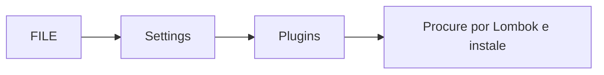

# TRUCK TERMINAL
Olá! É com muito prazer que apresento a vocês o sistema que desenvolvi. Foi desenvolvido na linguagem **Java** utilizando **Spring** para produzir a REST api de gerenciamento de terminal de caminhões.

# Configuração de ambiente
 **É necessário ter instalado na máquina a versão 8 do Java**.
 - Para sistema operacional Windows:
	 > [Link para download](https://www.java.com/pt_BR/download/help/windows_manual_download.xml)
- Para sistema operacional Mac OS:
	> [Link para download](https://www.java.com/pt_BR/download/help/mac_install.xml)
- Para sistema operacional Linux:
	>[Link para download](https://www.java.com/pt_BR/download/help/linux_install.xml)

Baixe esse repositório para sua área de trabalho ou o local que preferir.

Para visualizar melhor o código desenvolvido, instale uma IDE de sua preferência mas, eu sugiro o **Intellij da JetBrains** pois utilizei alguns plugins que estão disponíveis nele.

- Para sistema operacional Windows:
	> [Link para download](https://www.jetbrains.com/idea/download/#section=windows)
- Para sistema operacional Mac OS:
	>[Link para download](https://www.jetbrains.com/idea/download/#section=mac)
- Para sistema operacional Linux:
	>[Link para download](https://www.jetbrains.com/idea/download/#section=linux)

Após concluir a instalação, abra o projeto na IDE e aguarde o download das dependências do projeto.

É necessário adicionar o plugin do **Lombok** para que não quebre a aplicação, ele não traz nenhum grande ganho de performance, mas ele diminui a complexidade de código, a quantidade de linhas e aumenta a qualidade do código.

- Para instalar:

Para executar a aplicação, clique com o botão direito sobre o arquivo: **TruckTerminalApplication** que encontra-se na pasta **br.com.devnaweb.trucks** e pressione **Run**.

Você poderá ver a aplicação rodando na porta **8080**. Deixei alguns dados programados para inserção no banco de dados durante o tempo de compilação a fim de testes manuais dos endpoints desenvolvidos. Para acessar o banco de dados, vá para:
>[LOCALHOST](http://localhost:8080/h2)

Você pode também ver a cobertura de código em testes e executar os testes da aplicação clicando com o botão direito na pasta **java** que encontra-se em **test** e selecionando o desejado ou apenas clicando no botão como abaixo:

